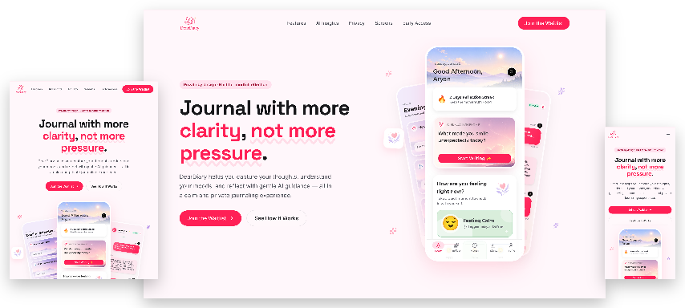

  

  # DearDiary

  **A private AI journaling companion for reflection, mood tracking, and emotional insight.**

DearDiary helps you build a gentle, consistent reflection habit. Capture your thoughts, check in with your mood, revisit meaningful moments, and discover emotional patterns over time—all within a calm and comforting journaling experience.

This repository contains the standalone DearDiary landing page, created to introduce the app and let people join the early-access waitlist.

## The DearDiary experience

- **Guided reflection** — Write freely or use thoughtful prompts when you need help getting started.
- **Mood check-ins** — Log how you feel and see how your emotions change over time.
- **Gentle AI reflections** — Receive compassionate observations designed to help you notice what matters.
- **Personal insights** — Explore recurring moods, themes, and weekly reflection patterns.
- **Journal history** — Revisit past entries, memories, and important moments whenever you choose.
- **AI journal chat** — Ask meaningful questions across your journal history and receive contextual answers.

## Private by design

DearDiary is designed around privacy, protection, and user control. The app is local-first with end-to-end encryption, and AI only processes what is needed for the reflections or insights you request. You can journal without AI and export your data at any time.

## Landing page

  

The landing page presents DearDiary's features, app screens, privacy principles, FAQs, and early-access signup in a warm, minimal experience that reflects the app itself.

DearDiary is currently preparing for public launch. Join the early-access waitlist through the landing page to be among the first to try it.
